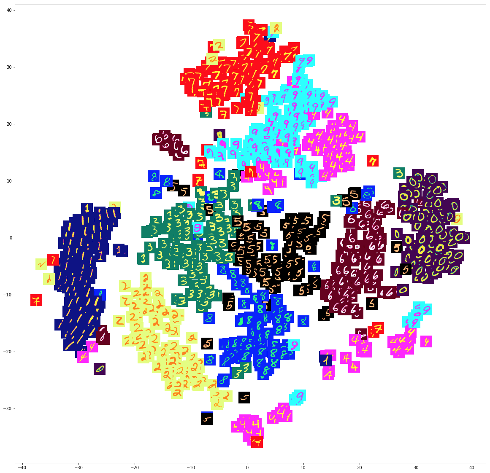
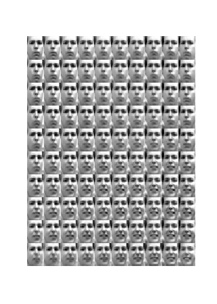
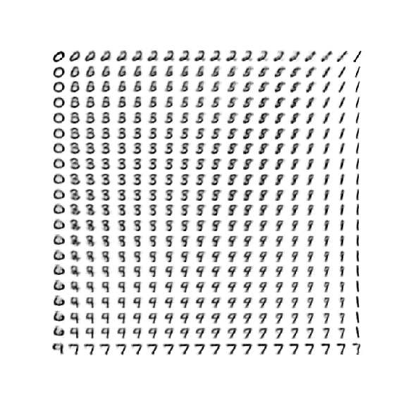

# AEVB In PyTorch

A custom implementation of AEVB/VAE in PyTorch

Here are some results:

t-SNE decomposition of a 20D latent space:

Different Writing Styles conditioned on Noise and Digit (CVAE mode):

Frey Face Latent Plot:

MNIST Latent Plot:

